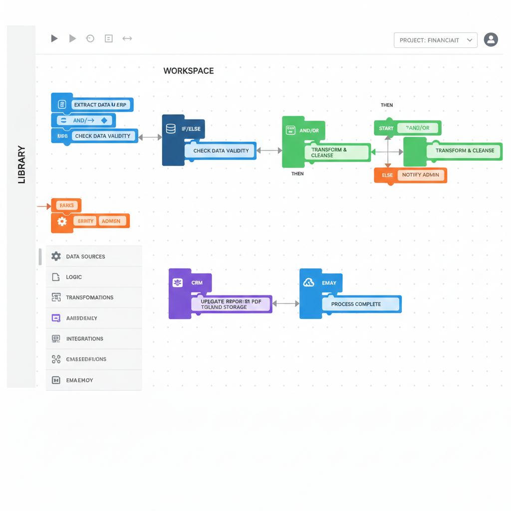
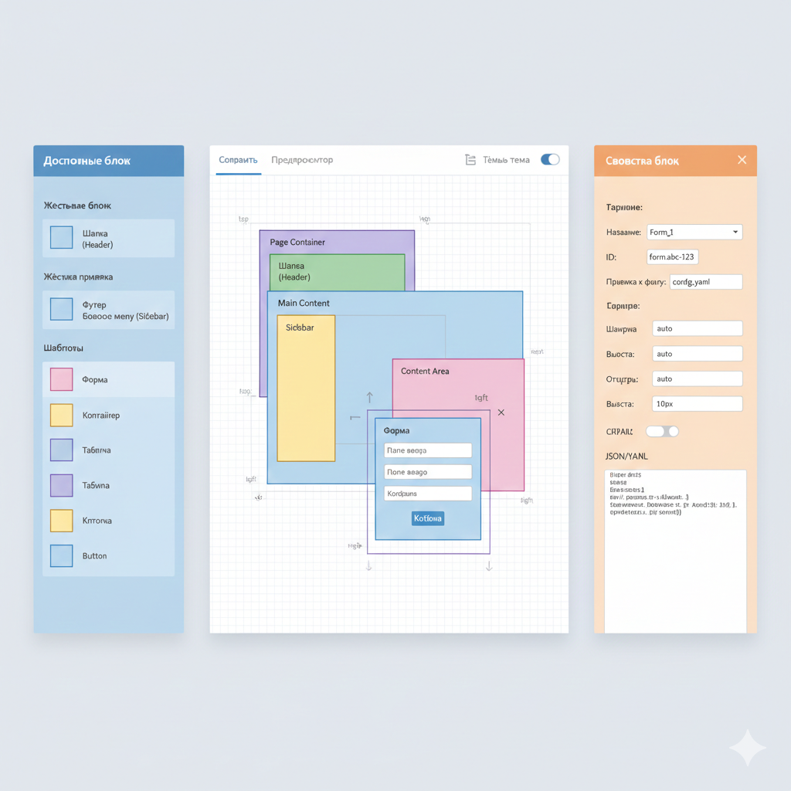
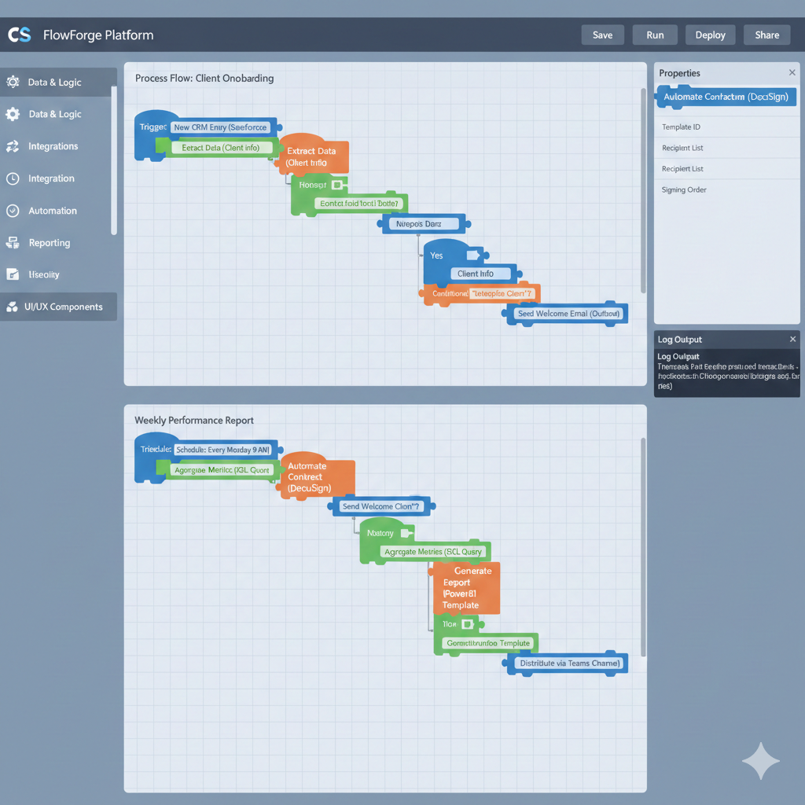

# Предварительное исследование: Архитектура визуального конструктора для enterprise-системы, использующей YAML как источник для генерации HTML

## Описание задачи

Задача заключается в разработке визуального редактора (visual builder или no-code/low-code tool), который позволит пользователям (разработчикам, администраторам или бизнес-пользователям) интуитивно редактировать конфигурационные файлы системы. Существующая enterprise-система уже собирает HTML из YAML файлов, что предполагает декларативный подход к описанию UI, логики и данных (аналогично DSL с вложенными структурами, выражениями и источниками данных).

## Архитектурное видение

Если исходить из сути задачи, мы создаём **надстройку над системой в виде дополнительного декларативного языка**.  

Проще говоря, у нас есть редактор с минимальным интерфейсом:  
- **Боковая панель** со списком блоков  
- **Рабочий стол** (canvas), на который блоки перетаскиваются  

Когда пользователь перемещает блоки на рабочем столе, связывает их между собой или изменяет их настройки (если блок поддерживает конфигурацию), система **автоматически формирует структурированные данные** — файл или объект состояния (state).

**Пример выходных данных (упрощённый):**

```json
{
  "blocks": [
    {
      "id": "block1",
      "configFile": "path/to/block1.config.json",
      "position": { "x": 100, "y": 100 },
      "relations": {
        "left": null,
        "right": "block2",
        "bottom": null
      }
    },
    {
      "id": "block2",
      "configFile": "path/to/block2.config.json",
      "position": { "x": 300, "y": 100 },
      "relations": {
        "left": "block1",
        "right": null,
        "bottom": null
      }
    }
  ],
  "layout": "row"
}
```

В этом примере:
- `block2` расположен справа от `block1`  
- Система выводит тип компоновки (`"row"`) на основе взаимного расположения блоков  

Конечный формат данных может варьироваться, но **ключевая суть** остаётся неизменной:  
> Редактор в результате манипуляций пользователя генерирует структурированное описание того, **какой блок где расположен** и **как связан с другими блоками**.

## Терминология: Canvas State

Для однозначного понимания в ходе разработки и обсуждений введём единую терминологию. Её можно будет переопределить или уточнить позднее, но в рамках текущих рассуждений будем использовать термин Canvas State.

### **Canvas State**  
*Состояние холста* — это структурированное представление конфигурации, которое формирует редактор в результате манипуляций пользователя (перетаскивание, связывание, настройка блоков).

**Определение:**  
Canvas State — это объект или файл, который содержит полное описание:
- Всех блоков, размещённых на рабочем столе
- Их взаимного расположения и связей
- Привязанных конфигурационных файлов
- Настроек свойств каждого блока
- Выведенной системой компоновки (layout)

**Пример структуры:**
```json
{
  "blocks": [...],
  "layout": "row",
  "metadata": {...}
}
```

---

В рамках обсуждения архитектурного видения мы определили следующее:

1. **Визуальный редактор** — это инструмент, который в результате взаимодействия с пользователем генерирует структурированный объект (код/конфигурацию).
2. **Canvas State** — это выходной формат, описывающий состояние редактора (расположение блоков, их связи, настройки).
3. **JSON-файлы системы** — это целевые файлы конфигурации, манипуляция которыми приводит к изменению поведения enterprise-системы.

Таким образом, возникает потребность в **программном слое** (или отдельном программном обеспечении), который будет выполнять роль **транслятора** между этими двумя уровнями представления.

**Архитектурная задача:**  
Разработать прослойку (или модуль внутри существующего ПО), которая:
- **На входе** принимает Canvas State
- **На выходе** производит целевые изменения в JSON-файлах системы

Эта прослойка обеспечит **синхронизацию** между визуальным представлением (редактором) и фактической конфигурацией системы, преобразуя декларативное описание интерфейса в конкретные изменения данных.


### **Альтернативные варианты названия:**
- **Editor State** — состояние редактора
- **Layout Configuration** — конфигурация компоновки  
- **Visual Blueprint** — визуальный чертёж
- **Canvas Snapshot** — снимок состояния холста


## Ключевой вывод

**Главный принцип архитектуры редактора:**  
Редактор в результате манипуляций пользователя (drag-and-drop, настройка, связывание) формирует **структурированное декларативное описание** того, 
- **какой блок** где расположен,
- **как связан** с другими блоками,
- **какие конфигурации** к нему применены.

Это описание (Canvas State) становится основой для генерации конечных конфигурационных файлов системы и представляет собой **абстрактное представление пользовательского интерфейса**, независимое от способа его дальнейшей реализации.

Данный подход является фундаментальным этапом в понимании и проектировании архитектуры визуальных low-code/no-code редакторов и декларативных систем конфигурации.

В рамках обсуждения архитектурного видения мы определили следующее:

1. **Визуальный редактор** — это инструмент, который в результате взаимодействия с пользователем генерирует структурированный объект (код/конфигурацию).
2. **Canvas State** — это выходной формат, описывающий состояние редактора (расположение блоков, их связи, настройки).
3. **JSON-файлы системы** — это целевые файлы конфигурации, манипуляция которыми приводит к изменению поведения enterprise-системы.

Таким образом, возникает потребность в **программном слое** (или отдельном программном обеспечении), который будет выполнять роль **транслятора** между этими двумя уровнями представления.

**Архитектурная задача:**  
Разработать прослойку (или модуль внутри существующего ПО), которая:
- **На входе** принимает Canvas State
- **На выходе** производит целевые изменения в JSON-файлах системы

Эта прослойка обеспечит **синхронизацию** между визуальным представлением (редактором) и фактической конфигурацией системы, преобразуя декларативное описание интерфейса в конкретные изменения данных.

Для этого слоя также необходимо определить терминологию. Например, можно использовать название **CanvasCompiler**, но, как и в случае с Canvas State, стоит рассмотреть альтернативные варианты, чтобы выбрать наиболее точно отражающий суть этого модуля.


**Альтернативные варианты названий для слоя преобразования:**

1. CanvasCompiler
2. CanvasTransformer  
3. ConfigGenerator
4. StateSerializer
5. LayoutProcessor
6. CompositionExporter
7. CanvasInterpreter
8. TransformationPipeline
9. ConfigOrchestrator
10. LayoutRenderer
11. CanvasProcessor
12. CompositionRenderer
13. ConfigBuilder
14. StateCompiler
15. LayoutGenerator

---

## Архитектура CanvasCompiler: многослойный подход

**CanvasCompiler** представляет собой наиболее сложную и ответственную часть приложения. Для обеспечения надёжности, тестируемости и гибкости целесообразно проектировать его по принципам, аналогичным классическим подходам в:

- **Архитектуре компиляторов** (фазы лексического анализа, синтаксического анализа, оптимизации, генерации кода)
- **ETL-системах** (Extract-Transform-Load) 
- **Low-code билдерах** (Webpack, Babel, компиляторы OutSystems)

Без разделения на слои/фазы компонент будет сложно тестировать, поддерживать и масштабировать.

---

### **Преимущества многослойного подхода:**

#### **1. Тестируемость**
Каждый слой — изолированный модуль с чётко определённым **input/output**. Это позволяет:
- Писать юнит-тесты для каждого слоя (Jest/Vitest)
- Мокать предыдущие слои при тестировании последующих
- Проверять корректность преобразования без касания реальных файлов

#### **2. Гибкость и расширяемость**
Легко добавлять, удалять или заменять отдельные слои:
- Добавление слоя AI-оптимизации компоновки
- Валидация на соответствие корпоративным стандартам (compliance)
- Поддержка новых форматов конфигурационных файлов

#### **3. Минимизация рисков**
Только последний слой (**Executor**) имеет право вносить изменения в файлы. Если ошибка возникает в предыдущих слоях, процесс останавливается, а существующие конфигурации остаются нетронутыми.

#### **4. Удобство отладки**
Каждый слой может логировать промежуточные результаты:
- Вывод в консоль в development-режиме
- Генерация debug-файлов с промежуточными представлениями
- Визуализация потока данных через слои

---

### **Что из себя будут представлять слои:**

На данном этапе необходимо чётко представлять, **как и во что** происходит преобразование на каждом уровне. Архитектура слоев требует отдельной проработки и детального обсуждения, так как каждый слой:

1. **Имеет свою специфическую ответственность**
2. **Определяет интерфейсы взаимодействия с соседними слоями**
3. **Требует выбора конкретных алгоритмов и структур данных**
4. **Влияет на общую производительность и надёжность системы**

Разработку и проектирование каждого слоя следует вести **отдельно**, с глубоким анализом:
- Входных и выходных данных
- Алгоритмов преобразования
- Обработки ошибок и валидации
- Тестовых сценариев и граничных случаев

Каждый слой — это самостоятельный модуль, который должен быть спроектирован, реализован и протестирован изолированно перед интеграцией в общий конвейер обработки.


---

### **Практическая польза разделения:**

- **Изолированные сбои**: ошибка в слое оптимизации не повлияет на валидацию
- **Постепенное внедрение**: можно начать с минимального набора слоёв
- **Профилирование производительности**: измерение времени выполнения каждого слоя
- **Модульные замены**: замена алгоритма трансформации без переписывания всей системы

Такой подход соответствует best practices разработки сложных преобразователей данных и обеспечивает долгосрочную поддержку системы.

## Интеграция ИИ-генерации в архитектуру

Система допускает интеграцию искусственного интеллекта для автоматической генерации конфигураций. ИИ может быть встроен на уровне взаимодействия с определёнными слоями архитектуры, используя документацию по их структуре и правилам.

### **Возможные точки интеграции:**

1. **На уровне Canvas State:**
   - ИИ анализирует требования и генерирует начальную структуру Canvas State
   - Пример: "Создай форму входа с полями email и паролем"

2. **На уровне трансформации:**
   - ИИ оптимизирует промежуточное представление (IR)
   - Анализ и улучшение структуры связей между компонентами

3. **На уровне генерации действий:**
   - ИИ предлагает оптимальные последовательности изменений
   - Предсказание потенциальных конфликтов и их разрешение

### **Преимущества подхода:**
- ИИ работает в рамках чётко определённых интерфейсов слоёв
- Каждый слой предоставляет структурированную документацию для обучения модели
- Возможность постепенного внедрения (сначала помощник, затем автономная генерация)

### **Архитектурный принцип:**
ИИ становится дополнительным модулем, который взаимодействует с системой через те же интерфейсы, что и остальные компоненты, обеспечивая согласованность и предсказуемость результатов.


---
# Ключевые требования к редактору:
- **Визуальное редактирование**: Drag-and-drop интерфейс для размещения блоков (форм, виджетов, контейнеров) на канвасе, с учётом позиций (left/right/bottom/top), которые влияют на конечную структуру (например, row/column layouts).


- **Модель блоков в системе может быть реализована двумя принципиально различными подходами:**

---

### **1. Жёсткая привязка к файлам**
Каждый блок изначально привязан к конкретному конфигурационному файлу (например, YAML).  
- **Как работает:**  
  Блок "загружается" вместе со всей своей логикой, структурой и поведением, описанными в файле.  
- **Плюсы:**  
  — Предсказуемость и консистентность  
  — Минимизация ошибок конфигурации  
  — Легче валидировать и контролировать  
- **Минусы:**  
  — Меньше гибкости на этапе проектирования  
  — Каждый новый блок требует создания отдельного файла  

---

### **2. Универсальные, неименованные компоненты-шаблоны**
Блоки из палитры — это абстрактные шаблоны (например, "Форма", "Контейнер", "Таблица"), которые становятся конкретными только после привязки к файлу конфигурации.  
- **Как работает:**  
  Пользователь перетаскивает шаблон, затем выбирает или назначает ему YAML-файл, который определяет поведение и внешний вид.  
- **Плюсы:**  
  — Гибкость и переиспользуемость одних и тех же шаблонов  
  — Быстрое прототипирование без создания лишних файлов  
  — Возможность менять конфигурацию "на лету"  
- **Минусы:**  
  — Требует дополнительного шага (привязки файла)  
  — Риск некорректной конфигурации или забытой привязки  

---
.
**Какой вариант стоит выбрать?**  
Первый подход подходит для стабильных, готовых компонентов системы.  
Второй — для гибкой, адаптивной разработки, где конфигурации часто меняются или создаются в процессе проектирования.  

Оба варианта могут быть совмещены: например, часть блоков — с жёсткой привязкой (базовые элементы UI), а часть — универсальные шаблоны (динамические формы, контейнеры).


- Список доступных блоков отображается в **боковой панели (левый сайдбар)** и содержит предопределённые элементы системы.
- **Визуальная компоновка с многосторонним позиционированием**
- Блоки могут размещаться **относительно друг друга с четырёх сторон**:
  - **Сверху (top)**
  - **Снизу (bottom)**
  - **Слева (left)**
  - **Справа (right)**
- Позиционирование блоков определяет **структуру конечной вёрстки** (например, преобразуется в row/column layouts, flex/grid-структуры при генерации HTML).

- **Динамическая система вложенности и иерархии**
- Размещение блока с определённой стороны относительно другого блока **автоматически создаёт или изменяет родительско-дочерние связи**.
- Редактор **визуализирует иерархию** (древовидную структуру) на основе взаимного расположения элементов.

- **Блоки с интерактивными элементами*- **
- Поддерживаются блоки, содержащие **формы ввода данных**, включая:
  - Поля ввода (текст, число, выбор)
  - Кнопки и управляющие элементы
  - Динамические виджеты
- Пользователь может **редактировать свойства блоков напрямую в интерфейсе**


**Примерные наброски дизайна для редактора**

Ниже представлены предварительные концепции и эскизы интерфейса визуального редактора — возможные варианты, представленные в общих чертах.





# Итоги Архитектурного Анализа

По сути, данный программный продукт состоит из двух совершенно разных программных модулей:

1. **Редактор, формирующий Canvas State** (Визуальная часть).
2. **CanvasCompiler** (Логическая часть).

Эти модули связаны между собой исключительно за счет обмена данными, реализуемого любым удобным способом.

## Принципы Независимости и Повторного Использования

**Модуль Редактора:** Компонент, формирующий Canvas State, может быть выделен в отдельный проект. Это позволит использовать его в других аналогичных продуктах.

**Модуль CanvasCompiler:** Является заточенным программным слоем, специфичным для текущей системы. Однако, при глубокой архитектурной проработке, логика компилятора может быть реализована по общему шаблону, что упростит создание аналогичных Compiler для будущих других проектов.


